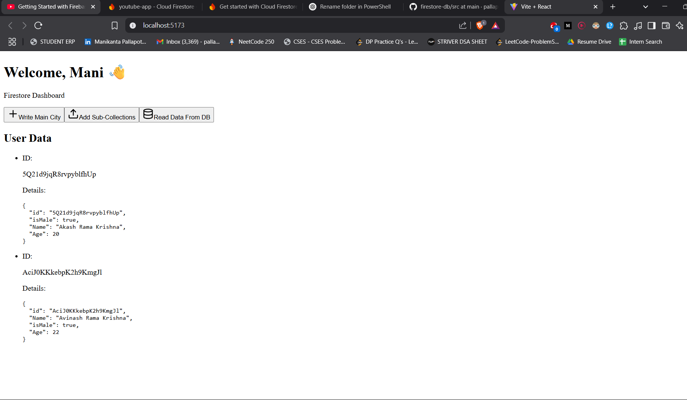
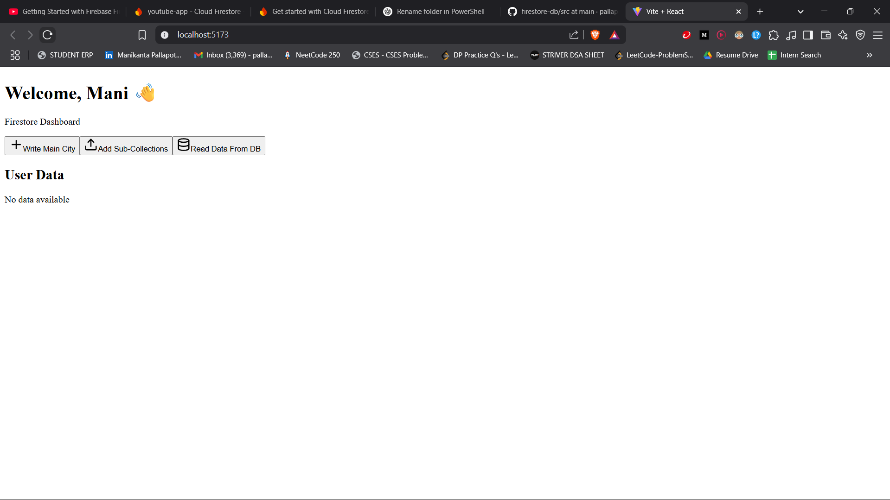

# Firestore Service Dashboard

A modern React + Vite dashboard for interacting with Firebase Firestore. This project demonstrates how to connect to Firestore, write documents, create subcollections, and read data, all with a beautiful UI powered by Tailwind CSS.

## Features

- ⚡️ Fast development with [Vite](https://vitejs.dev/)
- ⚛️ Built with [React 19](https://react.dev/)
- 🔥 Firebase Firestore integration (add/read documents, subcollections)
- 🎨 Styled with [Tailwind CSS](https://tailwindcss.com/)
- 🧩 ESLint for code quality
- 🖼️ [Lucide React](https://lucide.dev/) icons

## Getting Started

### 1. Clone the repository

```sh
git clone https://github.com/your-username/firestore-service.git
cd firestore-service


2. Install dependencies
npm install

3. Configure Firebase
Copy .env.example to .env and fill in your Firebase project credentials:

Get your Firebase config from the Firebase Console.

4. Start the development server

npm run dev

Open http://localhost:5173 to view the app.

Usage
Write Main City: Adds a city document to the cities collection.
Add Sub-Collections: Adds sector documents to a subcollection under a specific city.
Read Data From DB: Fetches and displays all documents from the users collection.

Project Structure

src/
  [App.jsx](http://_vscodecontentref_/1)           # Main dashboard component
  [firebase.js](http://_vscodecontentref_/2)       # Firebase initialization
  [main.jsx](http://_vscodecontentref_/3)          # App entry point
  [index.css](http://_vscodecontentref_/4)         # Tailwind CSS import
  [App.css](http://_vscodecontentref_/5)           # Custom styles
  assets/           # Static assets
public/
  vite.svg          # Favicon


  Scripts
npm run dev – Start development server
npm run build – Build for production
npm run preview – Preview production build
npm run lint – Lint code with ESLint


Environment Variables
See .env.example for required variables:

VITE_FIREBASE_API_KEY
VITE_FIREBASE_AUTH_DOMAIN
VITE_FIREBASE_PROJECT_ID
VITE_FIREBASE_STORAGE_BUCKET
VITE_FIREBASE_MESSAGING_SENDER_ID
VITE_FIREBASE_APP_ID
VITE_FIREBASE_DATABASE_URL


License
MIT

Made with ❤️ using React, Vite, and Firebase.

